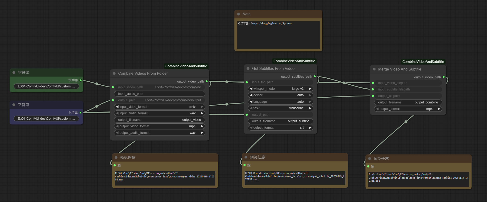

# ComfyUI-CombineVideoAndSubtitle

# 实现有三个节点

1.CombineVideosFromFolder: 从文件夹中合并视频，支持合并该文件夹下所有指定的相同类型的视频和音频合成为视频，并输出到指定目录

2.GetSubtitlesFromVideo：从视频中获取字幕，使用开源模型faster-whisper识别语音语言，并将语音转换为指定语言的字幕保存到指定文件夹，仅支持.srt和.vtt两种格式

3.MergeVideoAndSubtitle：合并视频和字幕，将字幕显示到视频中，使用ffmpeg将字幕显示到视频中，仅支持.srt和.vtt两种格式

# example nodes



# Installation

1. git clone repository into `ComfyUI\custom_nodes\`
```
https://github.com/xsai-collab/ComfyUI-CombineVideoAndSubtitle.git
```

2. Go to `ComfyUI\custom_nodes\ComfyUI-CombineVideoAndSubtitle` and run
```
pip install -r requirements.txt
```

If you are using the portable version of ComfyUI, do this:
```
python_embeded\python.exe -m pip install -r ComfyUI\custom_nodes\ComfyUI-CombineVideoAndSubtitle\requirements.txt
```